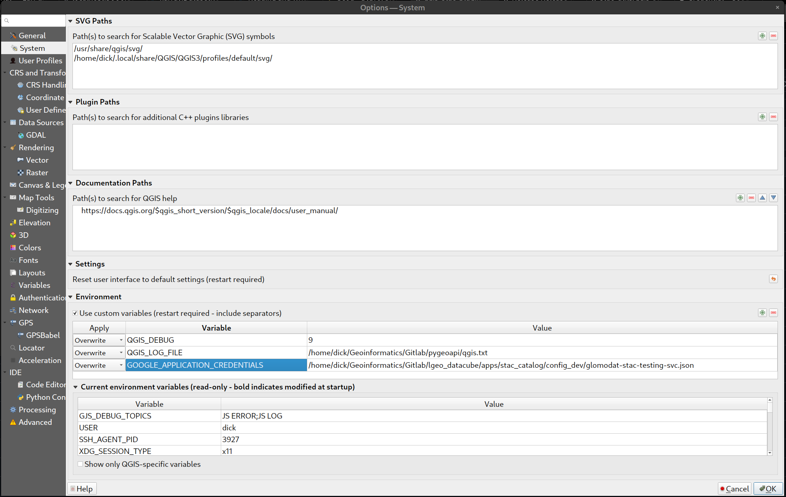
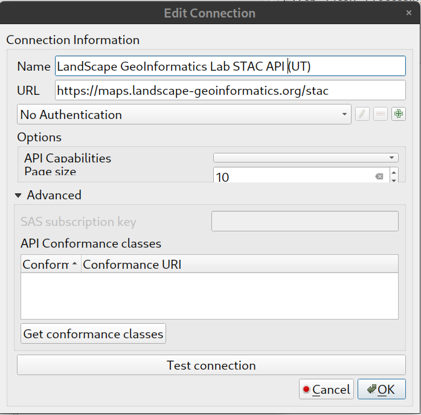
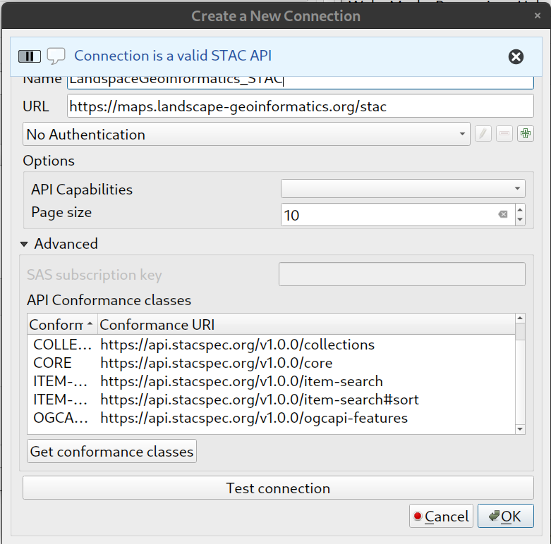
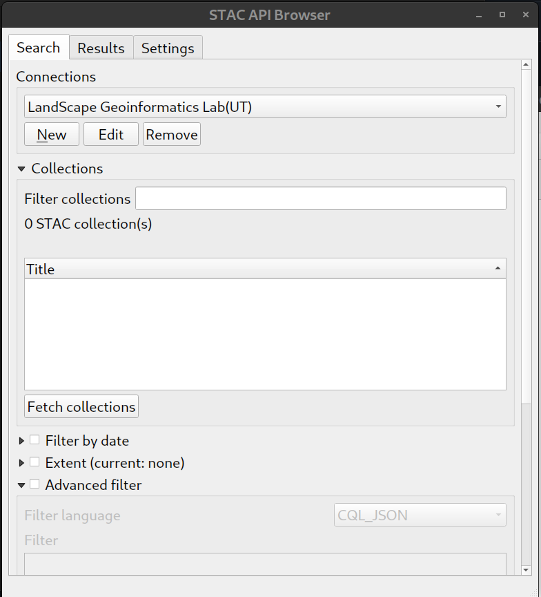
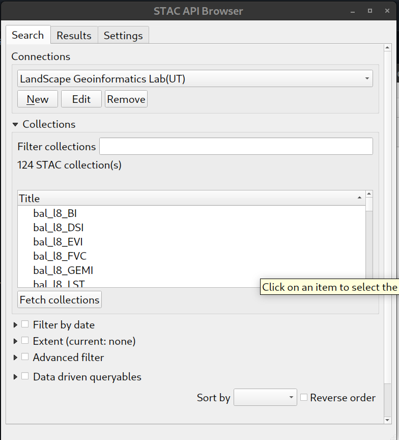
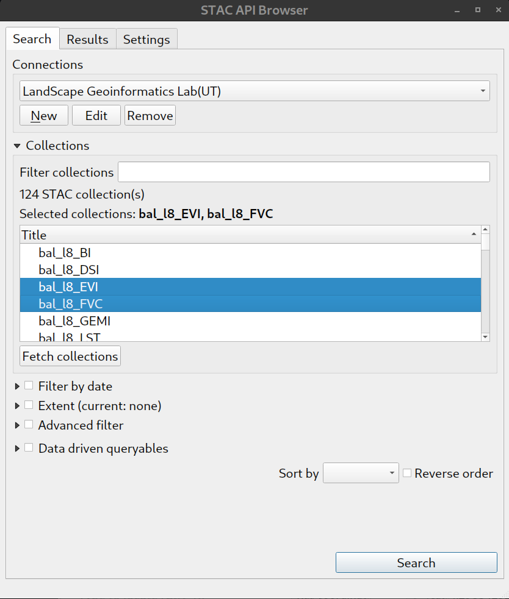
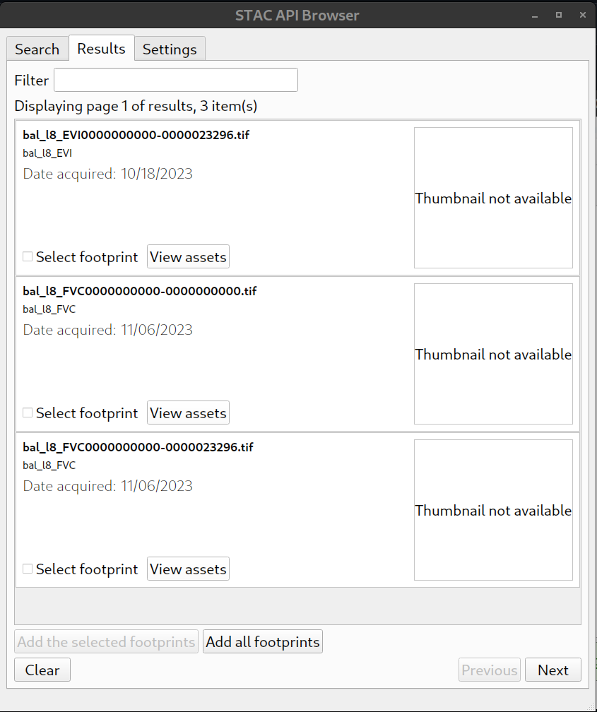
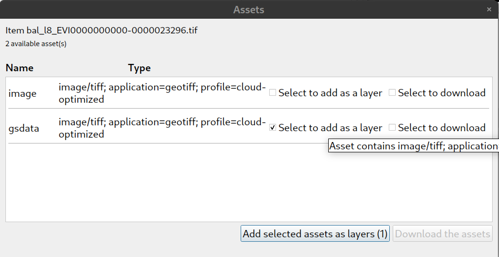
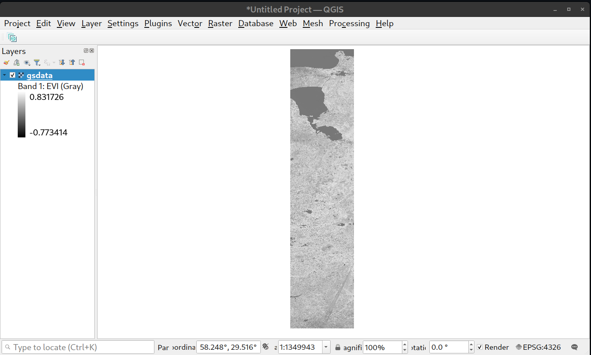

# qgis-stac-plugin (Custom with GCP access by vsigs)

QGIS plugin for reading STAC APIs 

Site https://stac-utils.github.io/qgis-stac-plugin

**The QGIS STAC API Browser currently lacks funding for maintenance,
bug fixes and new features; therefore development will be slow for now.
However we’re dedicated to maintaining the project. 
For assistance or if you have funding to contribute 
please reach out to Kartoza ([info@kartoza.com](mailto:info@kartoza.com))**
Customization Author : Landscap Geoinfomatics Lab (University of Tartu)

### Installation (From zip file)

1. Download the release 1.1.2b from 
2. Open the QGIS plugin manager, then select the **Install from ZIP**
3. Click on "..." and select the zip file download in step 1
4. Click install plugin

### Mini Howto

## (If bucket is not for public access) Add google cloud access credential to QGIS
1.  Obtain gcp access json
2.  In QGIS,  **Settings -> options**
3.  Click **System** on the left panel
4.  From the right panel, look for *Environment* Section
5.  Add a new variables with :
    - Apply : Overwrite
    - Variable : GOOGLE_APPLICATION_CREDENTIALS
    - Value : The path to the Google credential JSON file (ex. C:\Users\John\glomodat-stac-testing-svc.json)
6. Click ok

## Configuration of qgis-stac plugin
1. Open the STAC browser plugin from the plugin drop down
2. Click **New**
3. Type in the following information:
   - Name : whatever you want
   - URL  : https://maps.landscape-geoinformatics.org/stac
     

4. Click **Test Connection**
5. If the connection is ok , you will find a notification msg "Connection is a valid STAC API" as follow.
   

6. Cick OK

## Basic Operation on STAC
1. From the main browser UI, select the newly added connection from the drop down.

   
    
3. Click Fetch Collections, you will find those collections avaliable under the Collections Section
   
   

4. you can filter out collections you want by :
   - typing in collection name in the **Filter collections** text box
   - specify the Extent by clicking the Extent selction

5. Select collections that you want to browse, then click search

   

6. Assets under those collections that selected in the pervious step will be showns in result tab

   

7. Click on view assets, from here, to load the geotiff into QGIS, click **Select to add as layer** under the **gsdata** asset

   
   
9. The selected geotiff is now loaded into QGIS
    
   

   
