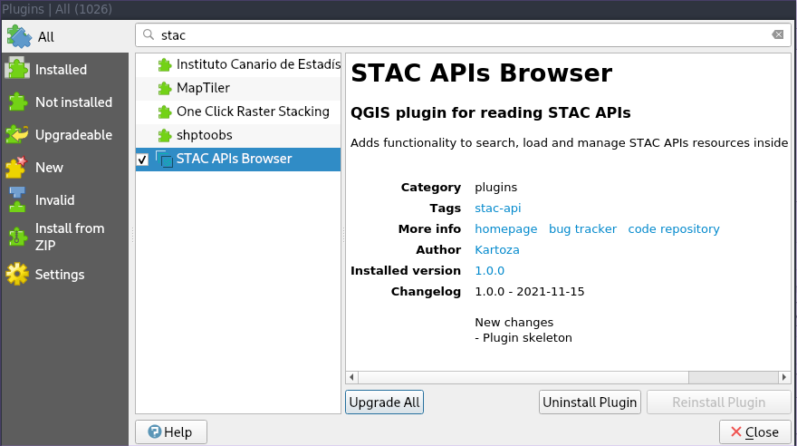

 
# Installation
The following sections explains how plugin users can install the plugin into the QGIS application, the
installation guide for plugin development purposes is covered here [development page](./development).

## From QGIS plugin repository
The plugin will be available in the QGIS official plugins repository

To install the plugin, follow the below steps

- Launch QGIS application and open plugin manager.
- Search **STAC API Browser** in the **All** page of the manager
- Click on the **STAC API Browser** result item and page with plugin information will show up.
- Click the install button with label **Install Plugin** from the plugin page.

_Plugin entry in the QGIS plugin manager_

## From a ZIP file

Get the plugin ZIP file from [https://github.com/stac-utils/qgis-stac-plugin/releases](https://github.com/stac-utils/qgis-stac-plugin/releases), select the required
release ZIP file and download it.

From the **Install from ZIP** page in the QGIS plugin manager, select the downloaded ZIP file and click the 
**Install Plugin** button to install it.

_Install from ZIP file page_

## Using custom plugin repository

The plugin has a custom plugin repository which has similar usage as the official QGIS plugin repository,
although the custom plugin repository contains only the **STAC API Browser** plugin versions.

Users can add the custom plugin repository inside the QGIS plugin manager, and use it to download and 
install the latest plugin versions, including versions that might not be available on the QGIS official 
plugin repository.

To add the custom repository and install the plugin from it. 

- Select the **Settings** page from the QGIS plugin manager.
- Click Add button on the **Plugin Repositories** group box and
use the plugin custom repository found here
[https://stac-utils.github.io/qgis-stac-plugin/repository/plugins.xml](https://stac-utils.github.io/qgis-stac-plugin/repository/plugins.xml)
 to create a new plugin repository.

_Adding another QGIS plugin repository_

After adding the repository make sure to enable installation of experimental plugin
before searching for the plugin as shown in the first section and installing it.

This is because the custom repository might contain plugin versions that have not been approved yet 
for official use.

