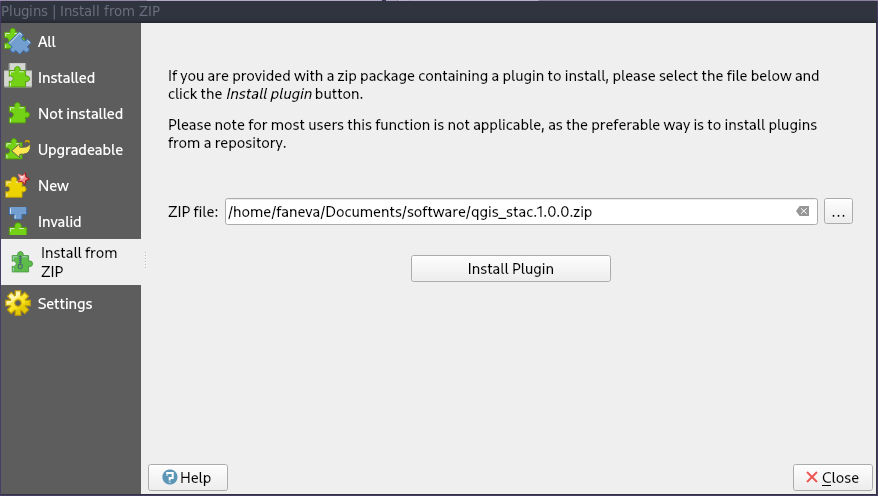

Open the QGIS plugin manager

## From QGIS repository

Once in the plugin manager, search for STAC APIs. QGIS will provide a list of plugins that have a similar name. If you click on the plugin, you will get its information. Select it, and **Install Plugin**.

**Note**: This option will only work after the plugin has been published in the official QGIS plugin repository.

## From ZIP

Download QGIS STAC APIs plugin https://github.com/stac-utils/qgis-stac-plugin/releases, select the required
release and download its ZIP file.

From the **Install from ZIP** page in the QGIS plugin manager, select the zip file and click the 
**Install Plugin** button to install plugin

## Using custom plugin repository

Select the **Settings** page, click Add button on the **Plugin Repositories** group box and 
use the plugin custom repository found here https://stac-utils.github.io/qgis-stac-plugin/repository/plugins.xml
 to create a new plugin repository.

After adding the repository make sure to enable installation of experimental plugin
before search for the plugin and installing it, as of time
writing this the plugin is tagged experimental.
