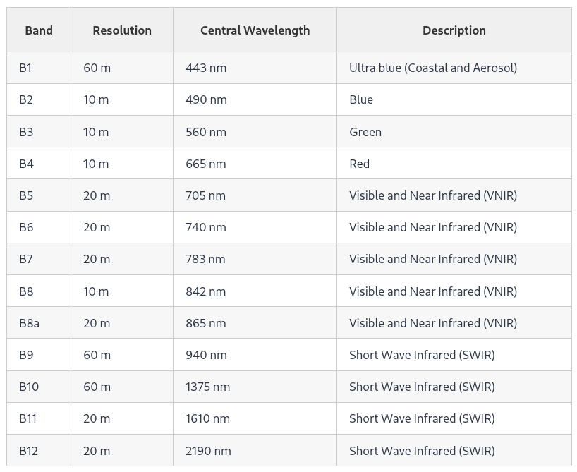

# Calculate NDIV from Sentinel 2 Imagery

## What is NDVI (Normalized Difference Vegetation Index)

NDVI is built from the red(R) and near-infrared (NIR) bands. The normalized vegetation index highlights the difference between the red band and the near-infrared band.

**NDVI = (NIR - R) / (NIR + R)**

This index is susceptible to the vegetation intensity and quantity.

NDVI values range from -1 to +1, the negative values correspond to surfaces other than plant covers, such as snow, water, or clouds for which the red reflectance is higher than the near-infrared reflectance.
For bare soil, the reflectances are approximately the same in the red and near-infrared bands, the NDVI presents values close to 0.

The vegetation formations have positive NDVI values, generally between 0.1 and 0.7. The highest values correspond to the densest cover.

NDVI is used in agriculture to assess the strength and quantity of vegetation by analyzing remote sensing measurements. NDVI is often used in precision agriculture decision-making tools.

## Sentinel 2 bands

Sentinel-2 has 13 spectral bands including 3 in the mid-infrared (mid-IR), they are ranging from 10 to 60-meter pixel size.

_Source: [https://gisgeography.com/sentinel-2-bands-combinations/](https://gisgeography.com/sentinel-2-bands-combinations/)_

In Sentinel 2 band red is represented by **B4** and the band near-infrared is **B8**

## Calculate NDIV in QGIS

To calculate NDIV in QGIS, use the raster calculator form menu **Raster** or from **Processing Toolbox** and add the NDVI formula above into the expression.
Use also **STAC API Browser** plugin to download sentinel 2 imagery. See [user guide](./user-guide)

### Watch the video

_Video demonstration of how to calculate NDVI using STAC API Browser_

