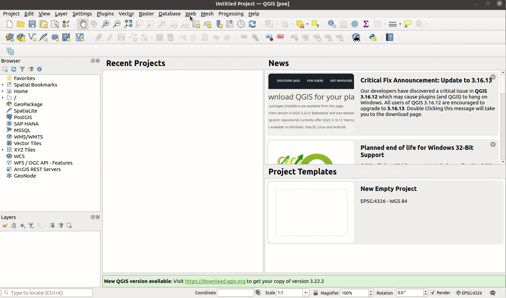
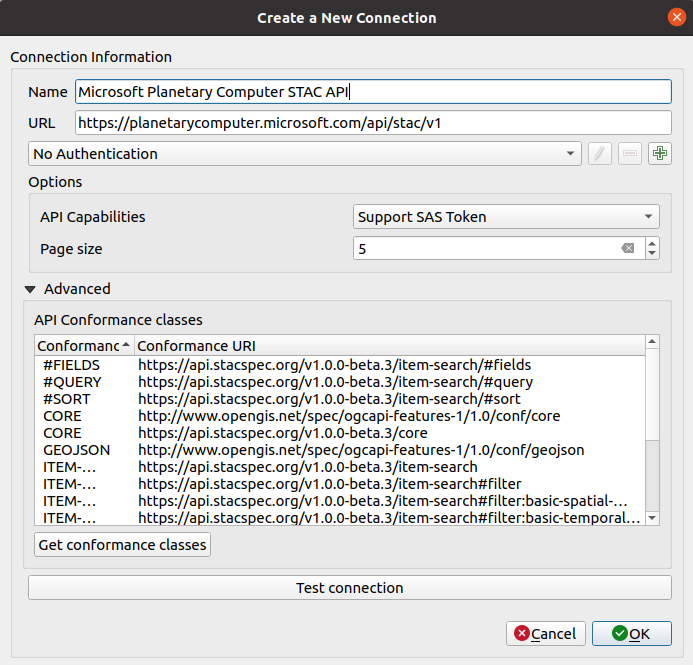
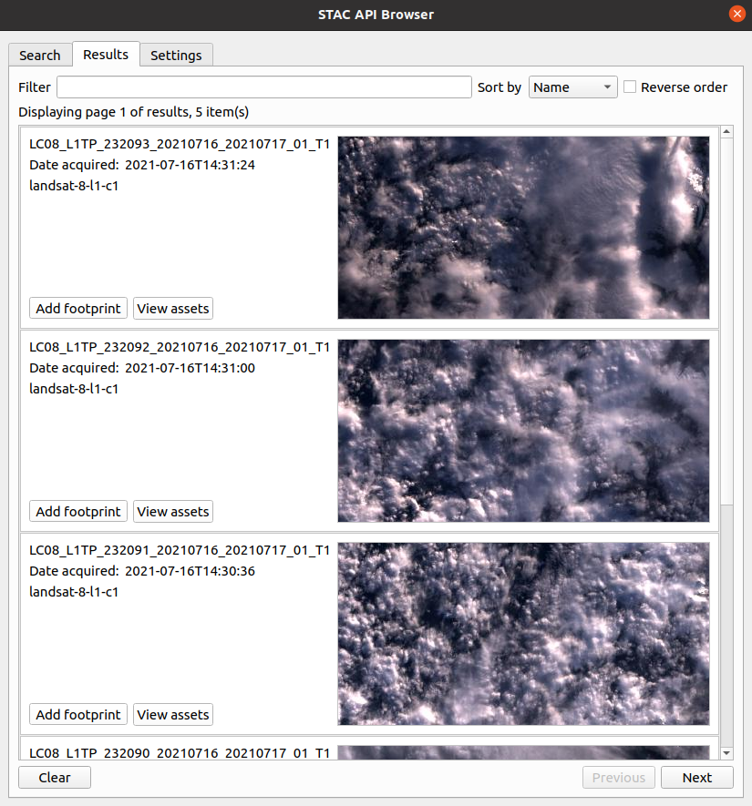
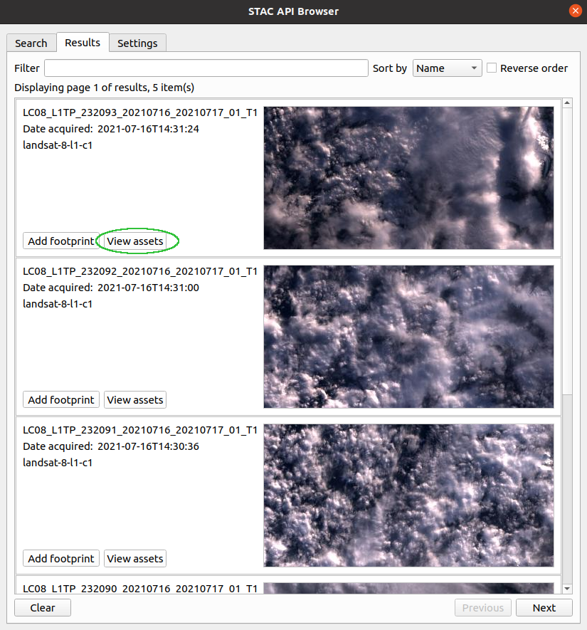
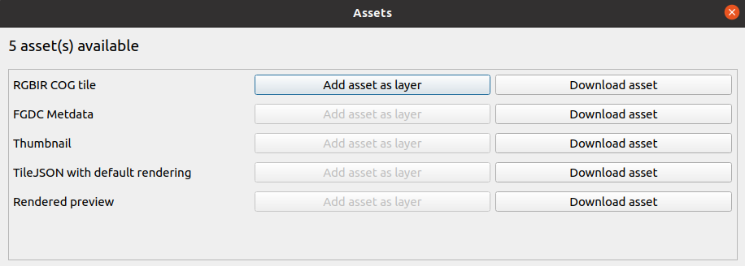
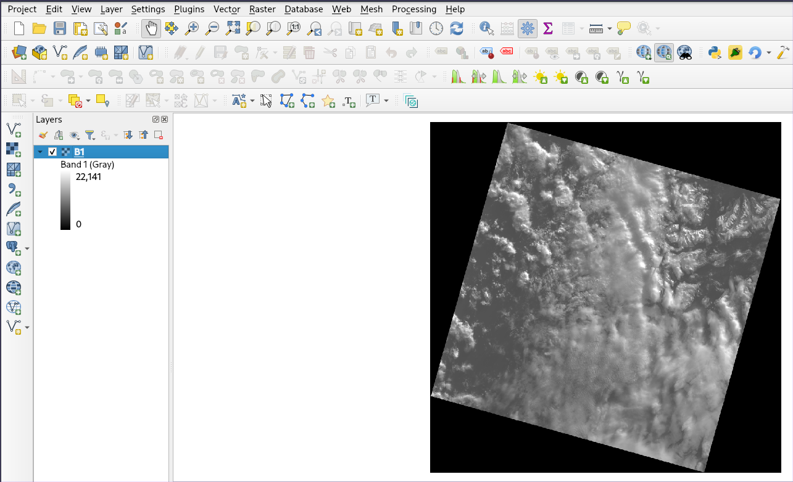
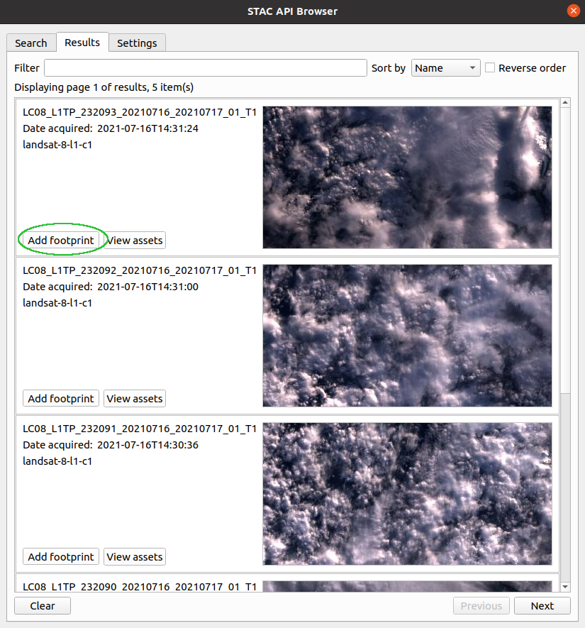

---
hide:
  - navigation
---

# User Guide
The plugin supports searching for STAC resources, loading and downloading STAC items,
retrieving information about the STAC API services.

STAC API services that adhere and conform to the standard STAC specification and practices are recommended
to be used in order to fully utilize the usage of the available plugin features.

## Features
The plugin features can be categorized in two parts, search of STAC resources and access of STAC assets.

### Search of STAC resources 
The STAC API specification allows search for core catalog API capabilities and search for STAC item object.
The plugin support item search and provides filters that can be used along with the search. 

The corresponding STAC API service used when searching needs to ensure that it has implemented the `/search` 
API endpoint accordingly to the specification,
see [https://github.com/radiantearth/stac-api-spec/tree/master/item-search](https://github.com/radiantearth/stac-api-spec/tree/master/item-search).

The plugin contains the following filters that can be used when searching for STAC items objects.

- **Date filter** - users can search for single instant temporal resources or resources with a temporal range.
- **Spatial extent filter** - users can provide a bounding box from which the results should be filtered against
- **Advanced Filter** - this enables usage of STAC API filter languages to provide advanced queries for the search
 for more information 
see [https://github.com/radiantearth/stac-api-spec/tree/master/fragments/filter](https://github.com/radiantearth/stac-api-spec/tree/master/fragments/filter).

### Accessing STAC assets 
Each STAC Item object contains a number of assets and a footprint which a GeoJSON geometry that defines the full
footprint of the assets represented by an item.

The plugin search results items contain a dedicated dialog for viewing, loading and downloading item assets into
QGIS, see [adding assets section](./user-guide#adding-assets) for more details.

## How to use
After installing the plugin in QGIS, the following sections provides a guide on how to use the plugin.
For the installation procedure see [installation page](./installation).

### Launching the STAC API Browser plugin

Three plugin menus can be used to launch the plugin in QGIS.

#### QGIS toolbar

In QGIS toolbar, there will be a plugin entry with the STAC APIs Browser icon.
Click on the icon to open the plugin main dialog.

_QGIS toolbar_

#### QGIS Plugins Menu
In the QGIS main plugins menu, Go to **STAC API Browser Plugin** > **Open STAC API Browser** 

_Screenshot showing how to use plugins menu to open the plugin_

#### QGIS Web Menu
In the QGIS web menu which is located in the toolbar,
Go to **STAC API Browser Plugin** > **Open STAC API Browser** 

_Screenshot showing how to use QGIS web menu to open the plugin_

### Adding a STAC API connection

The STAC API Browser provides by default some predefined STAC API service connections when installed for the first time.

To add a new STAC API service connection, click the **New** connection button, add the required details 
and click ok to save the connection.

_Connection dialog with a Microsoft Planetary Computer STAC API details_

The connection dialog contains a **API Capabilities** field which can be used to set the connection to use
a `SAS Token` [signing mechanism](https://planetarycomputer.microsoft.com/docs/concepts/sas/).
The signing mechanism includes a token that have expiry period, Users should research the API after the period passes in order to resign the items.

The **Advanced** group contain a list of the conformances type that the STAC API adhere to, when creating
new connections the list is empty, users can click the **Get conformance classes** button to fetch the conformance
classes. The above image shows the [Planetary Computer STAC API](https://planetarycomputer.microsoft.com/api/stac/v1)
with a list of conformances classes that have already been fetched.

### STAC API Items search

#### Using the search filters
All the search filters can be used only when their corresponding group boxes have been checked.

For the **Advanced filter** group, the available filter languages are based on the supported STAC API filter
languages, when **STAC_QUERY** is used then filter input will be treated as a [STAC QUERY](https://github.com/radiantearth/stac-api-spec/tree/master/fragments/query).
If **CQL_JSON** is selected then filter will used as a [CQL_FILTER](https://github.com/radiantearth/stac-api-spec/tree/master/fragments/filter).

_Available filters_

_Example search result items_

### Items footprint and assets

The plugin enables to loading STAC Item assets and footprints in QGIS as map layers.
After searching is complete and items footprint and assets can be viewed and added inside QGIS.

#### Adding and downloading item assets

The plugin currently support loading assets as [COGs](https://github.com/cogeotiff/cog-spec/blob/master/spec.md) layers in QGIS.
To add the assets into QGIS canvas, click the **View assets** button from the required result item.

_Image showing the button used for viewing the STAC item assets_

Assets dialog will be opened, from the assets list click **Add assets as layers** button to add the item into QGIS
as a COG layer, to download the asset click the **Download asset** button.

_Assets dialog_

_View of one of the added asset as a map layer in QGIS_

#### Adding item footprint

Click the **Add footprint** button to add the footprint of an item into QGIS canvas.
The footprint map layer will be loaded into QGIS, if the STAC item had properties then will be added in the
resulting map layer attribute table as layer data.

_Image showing the button used for adding the STAC item footprint_

